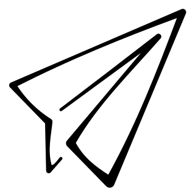

= Web Page origami.network

.Build statuses
[%autowidth, cols="^a,^a", options="header",]
|===
| master 
| latest

|
image::https://ci.appveyor.com/api/projects/status/stlymf6am469v1yd/branch/master?svg=true[master build, link="https://ci.appveyor.com/project/BartDubois/origami-network-github-io/branch/master"]
| 
image::https://ci.appveyor.com/api/projects/status/stlymf6am469v1yd?svg=true[latest build, link="https://ci.appveyor.com/project/BartDubois/origami-network-github-io"]
|===

// TODO: describe purpose

See tha page at https://origami.network.

== License

The work in this repository as well as its outcome is licensed under link:./LICENSE[CC BY-NC-ND 4.0].

image::https://i.creativecommons.org/l/by-nc-nd/4.0/88x31.png[Attribution-NonCommercial-NoDerivatives 4.0 International, link="./LICENSE"]
